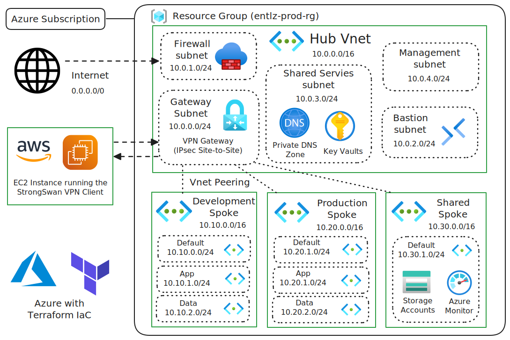

# Azure Hub-Spoke Landing Zone

[](https://www.terraform.io/)
[](https://azure.microsoft.com/)
[](LICENSE)

Enterprise-grade Azure Landing Zone implementing hub-spoke network architecture with centralized security, connectivity, and governance.

## What This Provisions

- **Hub-Spoke Network**: Centralized hub (10.0.0.0/16) with dev/prod/shared spokes
- **Azure Firewall**: Centralized security and egress filtering
- **VPN Gateway**: Hybrid connectivity (Site-to-Site and Point-to-Site)
- **Network Security Groups**: Granular network security controls
- **Key Vault**: Centralized secrets management with network isolation
- **Private DNS**: Internal name resolution across environments
- **Route Tables**: Forced tunneling through Azure Firewall

## Architecture



```
Hub VNet (10.0.0.0/16)
├── Gateway Subnet (10.0.0.0/24)      - VPN Gateway
├── Firewall Subnet (10.0.1.0/24)     - Azure Firewall
├── Bastion Subnet (10.0.2.0/24)      - Azure Bastion
├── Shared Services (10.0.3.0/24)     - Key Vault, DNS
└── Management (10.0.4.0/24)          - Management tools

Spoke VNets
├── Dev (10.10.0.0/16)     - Development workloads
├── Prod (10.20.0.0/16)    - Production workloads
└── Shared (10.30.0.0/16)  - Shared services
```

## Quick Start

### Prerequisites

- Azure CLI logged in with Contributor permissions
- Terraform >= 1.5.0
- Key Vault Administrator role (for secrets management)

### Deploy

```bash
# Clone and initialize
git clone <repository>
cd Azure-hubspoke-landingzone
terraform init

# Configure variables
cp terraform-enterprise.tfvars.example terraform-enterprise.tfvars
# Edit terraform-enterprise.tfvars with your values

# Set VPN shared key
export TF_VAR_vpn_shared_key="your-secure-shared-key"

# Deploy
terraform plan -var-file="terraform-enterprise.tfvars"
terraform apply -var-file="terraform-enterprise.tfvars"
```

## Key Features

### Security
- **Defense in Depth**: Multiple security layers (Firewall, NSGs, Private Endpoints)
- **Zero Trust**: Deny-by-default with explicit allow rules
- **Forced Tunneling**: All internet traffic through Azure Firewall
- **Network Isolation**: Private endpoints for Azure services

### Connectivity
- **Hybrid VPN**: Site-to-Site connectivity to on-premises/AWS
- **Hub-Spoke Peering**: Centralized connectivity model
- **Private DNS**: Internal name resolution

### Governance
- **Consistent Tagging**: Environment, cost center, owner tracking
- **Modular Design**: Reusable Terraform modules
- **RBAC Ready**: Supports granular permissions

## Deployment Considerations

### Remote State
For production deployments, configure remote state:

```hcl
terraform {
  backend "azurerm" {
    resource_group_name  = "terraform-state-rg"
    storage_account_name = "terraformstate"
    container_name       = "tfstate"
    key                  = "landing-zone.tfstate"
  }
}
```

### Credentials
- Use Azure CLI authentication for development
- Use Managed Identity or Service Principal for CI/CD
- Store VPN shared key in Azure Key Vault or environment variables

### Costs
Estimated monthly costs (Australia Southeast):
- VPN Gateway (VpnGw1): ~$140 AUD
- Azure Firewall (Standard): ~$950 AUD
- Key Vault: ~$3 AUD
- **Total**: ~$1,100 AUD/month

### Regions
Tested in Australia Southeast. Update `location` variable for other regions.

### Policies
Consider implementing Azure Policy for:
- Required tags enforcement
- Allowed VM sizes
- Network security compliance

## Customization

### Adding New Spokes

```hcl
# In terraform-enterprise.tfvars
spoke_configs = {
  dev    = { address_space = "10.10.0.0/16" }
  prod   = { address_space = "10.20.0.0/16" }
  shared = { address_space = "10.30.0.0/16" }
  test   = { address_space = "10.40.0.0/16" }  # New spoke
}
```

### Custom NSG Rules

```hcl
nsg_rules = {
  prod = {
    AllowDatabase = {
      priority                   = 200
      direction                  = "Inbound"
      access                     = "Allow"
      protocol                   = "Tcp"
      source_port_range          = "*"
      destination_port_range     = "1433"
      source_address_prefix      = "10.20.1.0/24"
      destination_address_prefix = "10.20.2.0/24"
    }
  }
}
```

## Why This Matters

- **Scalability**: Hub-spoke model supports growth without complexity
- **Security**: Enterprise-grade network security and isolation
- **Compliance**: Audit logging and network controls for regulatory requirements
- **Cost Optimization**: Centralized services reduce operational overhead
- **Developer Experience**: Consistent networking across environments

## Module Structure

```
modules/
├── networking/
│   ├── hub/           - Hub VNet with core subnets
│   └── spoke/         - Spoke VNet with workload subnets
├── security/
│   ├── firewall/      - Azure Firewall with rules
│   └── nsg/           - Network Security Groups
└── foundation/
    ├── keyvault/      - Key Vault for secrets
    ├── dns/           - Private DNS zones
    └── vpn/           - VPN Gateway and connections
```

## Contributing

See [CONTRIBUTING.md](CONTRIBUTING.md) for development workflow.

## License

This project is licensed under the MIT License - see the [LICENSE](LICENSE) file for details.