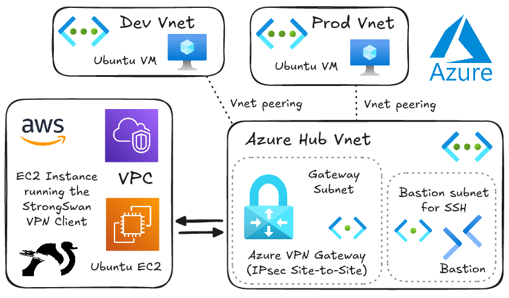
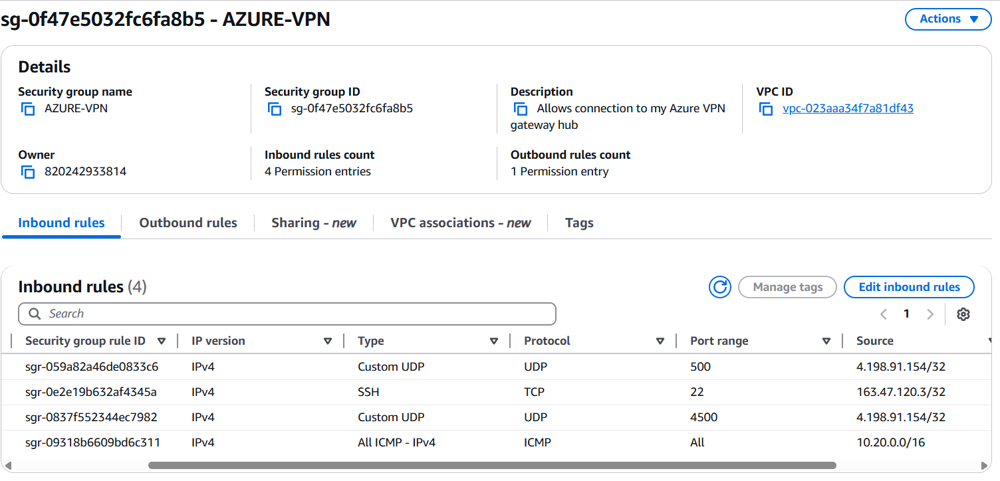
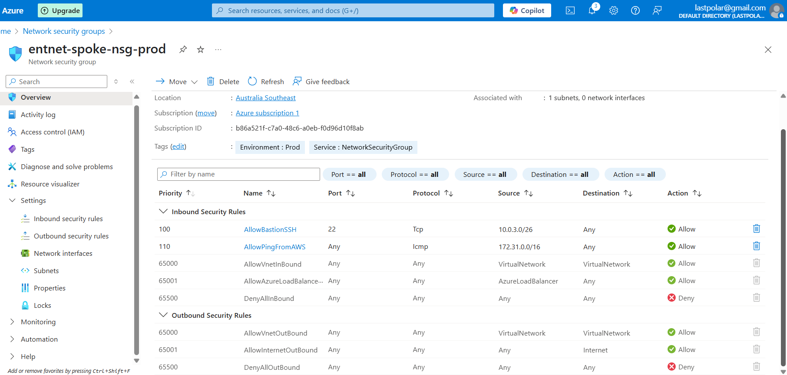
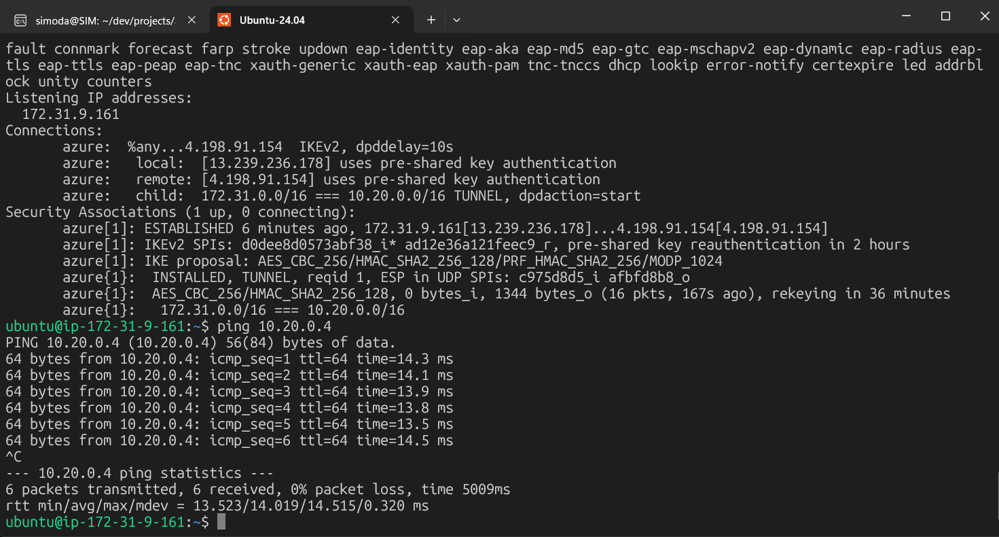
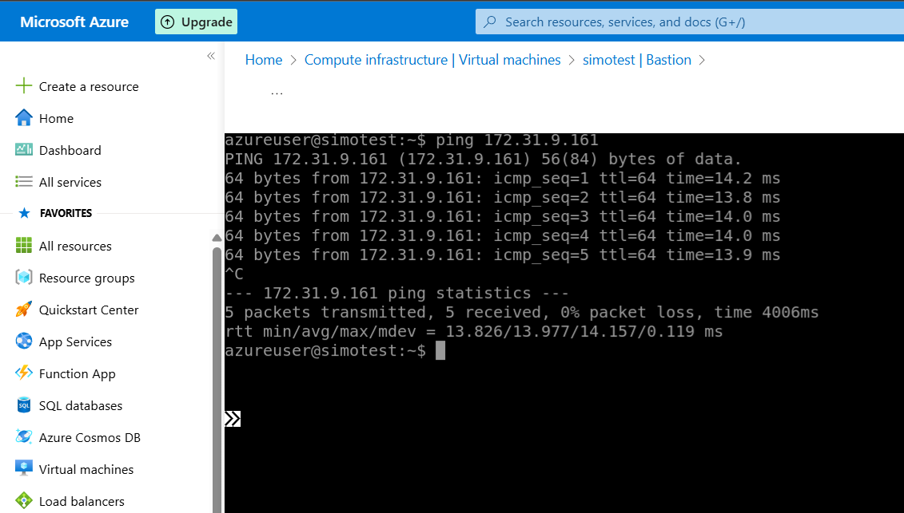

# Azure Hub-Spoke Network with Site-to-Site VPN to AWS (strongSwan) - with screenshots below

This project deploys a robust network architecture in Microsoft Azure using the Hub-Spoke topology, and establishes a secure Site-to-Site (S2S) VPN connection to an Amazon Web Services (AWS) Virtual Private Cloud (VPC) running a strongSwan IPSec VPN server. All infrastructure is defined and managed using Terraform, except the Azure VM and the AWS EC2 instance which were manually provisioned.

**Personal Context:** Initially, the goal was to simulate an "on-premises" VPN connection from my home network. However, due to Carrier-Grade NAT (CGNAT) issues with my home IP address, a direct connection wasn't feasible. This led to a pivot: instead of a direct home VPN, I leveraged an AWS EC2 instance to act as my "on-premises" VPN endpoint. This challenge unexpectedly transformed the project into an even more exciting **hybrid cloud** scenario, demonstrating seamless and secure connectivity between Azure and AWS.



## What This Project Builds

This Terraform configuration sets up the following core components:

### Azure Side (Hub-Spoke Network)

- **Resource Group:** A dedicated container for all Azure resources.
- **Hub Virtual Network (VNet):** The central network acting as the "hub."
  - **Gateway Subnet:** A dedicated subnet within the Hub VNet for the VPN Gateway.
  - **Azure Firewall Subnet:** A dedicated subnet for the Azure Firewall.
  - **Azure Bastion Subnet:** A dedicated subnet for Azure Bastion.
- **Spoke Virtual Networks (VNets):** Two separate "spoke" VNets (e.g., "Development" and "Production") peered with the Hub VNet.
  - Each Spoke VNet has a default subnet and is associated with a route table.
- **Virtual Network Peering:** Connections between the Hub and Spoke VNets, allowing traffic to flow between them.
- **Azure Firewall:** A managed, cloud-based network security service providing network rule collection (e.g., for egress filtering).
- **Azure Virtual Network Gateway (VPN Gateway):** A highly available, managed VPN service in the Hub VNet.
- **Local Network Gateway:** Represents the on-premises (or in this case, AWS VPC) network, including its public IP and CIDR ranges.
- **VPN Gateway Connection (IPsec S2S):** The secure tunnel establishing connectivity between the Azure VPN Gateway and the strongSwan VPN server on AWS.
- **Azure Bastion:** A managed service for secure SSH/RDP access to VMs within your Azure VNets without exposing them directly to the public internet.
- **Public IP Addresses:** Allocated for the Azure Firewall, VPN Gateway, and Azure Bastion for external connectivity.
- **Route Tables:** Configured to direct traffic from spoke networks through the Azure Firewall to the internet (default route) and to the AWS network (VPN route).
- **Private DNS Zone:** Configured for private DNS resolution within Azure, especially useful for integrated services.

### AWS Side (On-premises VPN Endpoint)

- **EC2 Instance:** A Linux virtual machine (e.g., Ubuntu) running the strongSwan IPSec VPN software. This instance acts as the "on-premises" VPN endpoint.
- **Security Group:** Configured on the EC2 instance to allow necessary VPN traffic (UDP 500, UDP 4500) and SSH access.
- **Elastic IP:** An optional static public IP assigned to the EC2 instance (though a dynamic public IP also works for a lab setup).

## Why This Setup is Useful (The "Why")

This architecture addresses several key networking and security requirements in a cloud environment:

1.  **Hub-Spoke Network Topology:**

    - **Centralized Services:** Allows you to centralize shared services (like firewalls, VPN gateways, monitoring) in the Hub VNet.
    - **Simplified Management:** Reduces complexity for routing and security policies compared to a flat network.
    - **Scalability:** Easily add new "spoke" VNets for different departments, environments (Dev/Prod), or applications without redesigning the core network.
    - **Isolation:** Provides network isolation between different spoke environments while maintaining connectivity to shared services.

2.  **Hybrid Cloud Connectivity (Azure to AWS S2S VPN):**

    - **Secure Interoperability:** Establishes a secure, encrypted tunnel (IPSec VPN) between your Azure environment and a different cloud provider (AWS), enabling hybrid cloud scenarios.
    - **Data Encryption:** All traffic traversing the VPN tunnel is encrypted, protecting sensitive data as it moves between clouds.
    - **Disaster Recovery / Multi-Cloud Strategy:** Forms a foundational building block for multi-cloud deployments, disaster recovery, or seamlessly extending your enterprise network across cloud providers.
    - **Resource Access:** Allows virtual machines and services in Azure to securely communicate with resources in your AWS VPC, and vice versa, as if they were on the same network.

3.  **Enhanced Security with Azure Firewall:**

    - **Centralized Egress Control:** The Azure Firewall acts as a central point for inspecting and filtering all outbound (egress) traffic from your spoke networks to the internet, enforcing corporate security policies.
    - **Threat Protection:** Provides built-in threat intelligence and filtering capabilities.

4.  **Secure Remote Access with Azure Bastion:**

    - Eliminates the need to expose VMs to the public internet via public IPs for RDP/SSH, significantly reducing the attack surface.
    - Provides secure, browser-based access.

5.  **Infrastructure as Code (IaC) with Terraform:**
    - **Automation:** Automates the entire deployment process, making it repeatable and less prone to manual errors.
    - **Consistency:** Ensures consistent deployments across environments.
    - **Version Control:** Allows you to version control your infrastructure definitions, track changes, and collaborate effectively.
    - **Auditability:** Provides a clear, auditable record of your infrastructure's desired state.

## Getting Started / Deployment Steps

1.  **Prerequisites:**

    - [Terraform](https://developer.hashicorp.com/terraform/downloads) (CLI installed)
    - [Azure CLI](https://learn.microsoft.com/en-us/cli/azure/install-azure-cli) (logged in and configured with an Azure subscription)
    - [AWS CLI](https://docs.aws.amazon.com/cli/latest/userguide/getting-started-install.html) (configured with AWS credentials)
    - An AWS EC2 instance running Ubuntu (e.g., `t3.micro`) configured with a Public IP and a Security Group allowing UDP ports 500, 4500, and TCP port 22 (for SSH).
    - A strong, complex shared key (PSK) for the VPN connection.

2.  **Clone the Repository:**

    ```bash
    git clone [https://github.com/Simodalstix/az-hub-spoke-vpn.git](https://github.com/Simodalstix/az-hub-spoke-vpn.git)
    cd az-hub-spoke-vpn
    ```

3.  **Initialize Terraform:**

    ```bash
    terraform init
    ```

4.  **Configure Variables:**

    - Create a file named `terraform.tfvars` in the root of the project.
    - Add your chosen VPN shared key and other variable values as needed.
    - **Example `terraform.tfvars`:**
      ```terraform
      prefix          = "prodnet" # Or "devnet", "lab", etc.
      location        = "australiasoutheast" # Or "eastus", "westeurope" etc.
      # ... other variables from variables.tf if desired ...
      vpn_shared_key  = "YOUR_REALLY_STRONG_AND_COMPLEX_SHARED_KEY_HERE"
      ```
    - **Ensure `terraform.tfvars` is ignored by Git** (it should be covered by `.gitignore`).

5.  **Review and Apply Terraform Plan (Azure Side):**

    - Review the changes Terraform will make:
      ```bash
      terraform plan
      ```
    - Apply the changes to deploy the Azure infrastructure:
      ```bash
      terraform apply
      ```
    - **Note:** The VPN Gateway connection provisioning can take 20-45 minutes.

## strongSwan VPN Configuration on AWS EC2

Originally, I planned to simulate an on-premises VPN from my apartment. But my ISP uses Carrier-Grade NAT (CGNAT), which meant I couldn’t expose a public IP to receive incoming VPN connections.

Instead of shelving the idea, I pivoted — and spun up an AWS EC2 instance to act as the on-prem endpoint. This turned the project into a practical **multi-cloud lab**, connecting Azure and AWS over a real site-to-site IPsec tunnel.

The EC2 instance runs strongSwan, which manages the IPsec connection back to Azure.

### 1. Install strongSwan

```bash
sudo apt update
sudo apt install strongswan strongswan-pki -y
```

### 2. Configure `/etc/ipsec.conf`

```conf
config setup
  charondebug="ike 2, knl 2, cfg 2, net 2, esp 2, dmn 2, mgr 2, enc 2"
  strictcrlpolicy=no
  uniqueids=no

conn azure
  type=tunnel
  authby=psk
  left=%defaultroute                # EC2's public IP
  leftid=13.239.236.178
  leftsubnet=172.31.0.0/16
  right=4.198.91.154                # Azure VPN Gateway public IP
  rightsubnet=10.20.0.0/16
  ike=aes256-sha256-modp1024!
  esp=aes256-sha256!
  auto=start
  keyexchange=ikev2
  dpddelay=10s
  dpdtimeout=30s
  dpdaction=restart
  aggressive=no
  fragmentation=yes
  forceencaps=yes
  mark=%unique
```

### 3. Add the shared key to `/etc/ipsec.secrets`

```conf
13.239.236.178 4.198.91.154 : PSK "YOUR_SHARED_KEY"
```

> Make sure the PSK matches the value used in Azure’s VPN connection.

### 4. Enable and start the service

```bash
sudo ipsec restart
sudo ipsec statusall
```

---

### Troubleshooting

If traffic isn't flowing but the tunnel is up:

- Check `/var/log/syslog` or `sudo journalctl -u strongswan`
- Use `tcpdump -n -i any icmp`
- Check NSG/SG rules
- Ensure VNet peering has `use_remote_gateways = true`

## Cleanup

To destroy all provisioned Azure resources and avoid incurring costs:

```bash
terraform destroy
```

## Lab Validation Screenshots

**AWS Security Group Inbound Rules**

The EC2 instance is configured to allow UDP ports 500 and 4500 (for IPsec) and TCP port 22 (SSH) from Azure. Outbound traffic is unrestricted.



---

**Azure NSG Inbound Rules for the Spoke Subnet**

This NSG allows ICMP (ping) traffic from the AWS subnet and SSH traffic from Azure Bastion.



---

**VPN Tunnel Established and Ping to Azure VM**

This screenshot shows the IPsec tunnel established (`ipsec statusall`) and successful ping responses from the Azure production spoke VM (`10.20.0.4`).



---

**Ping from Azure to AWS EC2 via Bastion**

This shows the reverse ping test — from the Azure VM (accessed via Azure Bastion) back to the AWS EC2 instance (`172.31.9.161`).


